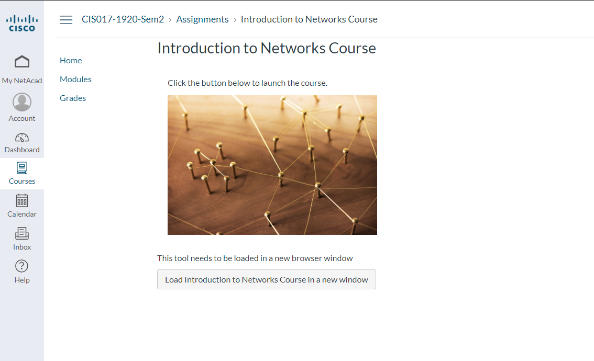

# Cisco Scrapper

Tool to archive your CISCO course.

Note: Given that this is a scrapper it is not entirely reliable, even now at the time of making sometimes it fails to detect the button to login, other times it fails to load the course page and it is instead taken to an invalid-session page, just run the tool a few times until it works, after all the purpose is to get the course once, so I won't be spending more time on this fixing minor issues like that.

# Configuration

Configure `netacad-config.js` with your email and password, the `course_button_url` must be configured with the URL of the page where it should have a button that says `Load `**course name**` in a new window`, as seen in the screenshot bellow:




The course_url should be the page that opens when you click the example above, in my case:


# Run 

First, install the dependencies with:

```
npm i
```

Run the code with:

```
npm start
```
