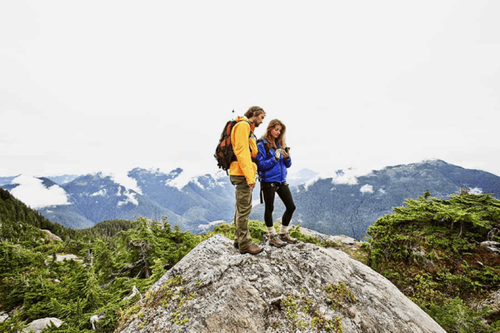

undefined
<button aria-label="Bookmark 1.1.1 Networks Connect Us" class="btn btn--icon btn--small btn--secondary bookmark-btn "></button>

1.1.1

<h2>Networks Connect Us</h2>

Among all of the essentials for human existence, the need to interact with others ranks just below our need to sustain life. Communication is almost as important to us as our reliance on air, water, food, and shelter.

In today’s world, through the use of networks, we are connected like never before. People with ideas can communicate instantly with others to make those ideas a reality. News events and discoveries are known worldwide in seconds. Individuals can even connect and play games with friends separated by oceans and continents.

<button aria-label="Bookmark 1.1.2 Video - The Cisco Networking Academy Learning Experience" class="btn btn--icon btn--small btn--secondary bookmark-btn "></button>

1.1.2

<h2>Video - The Cisco Networking Academy Learning Experience</h2>

World changers aren't born. They are made. Since 1997 Cisco Networking Academy has been working towards a single goal: the educating and skill building of the next generation of talent required for the digital economy.

Click Play to how Cisco Networking Academy to learn how we use technology to make the world a better place.

CC

<button aria-label="Bookmark 1.1.3 No Boundaries" class="btn btn--icon btn--small btn--secondary bookmark-btn "></button>

1.1.3

<h2>No Boundaries</h2>

Advancements in networking technologies are perhaps the most significant changes in the world today. They are helping to create a world in which national borders, geographic distances, and physical limitations become less relevant, presenting ever-diminishing obstacles.

The internet has changed the manner in which our social, commercial, political, and personal interactions occur. The immediate nature of communications over the internet encourages the creation of global communities. Global communities allow for social interaction that is independent of location or time zone.

The creation of online communities for the exchange of ideas and information has the potential to increase productivity opportunities across the globe.

The creation of the cloud lets us store documents and pictures and access them anywhere, anytime. So whether we are on a train, in a park, or standing on top of a mountain, we can seamlessly access our data and applications on any device.

two people on a mountain top looking at a hand-held mobile device

<button aria-label="Zoom image" data-rmiz-btn-open="true"></button>

